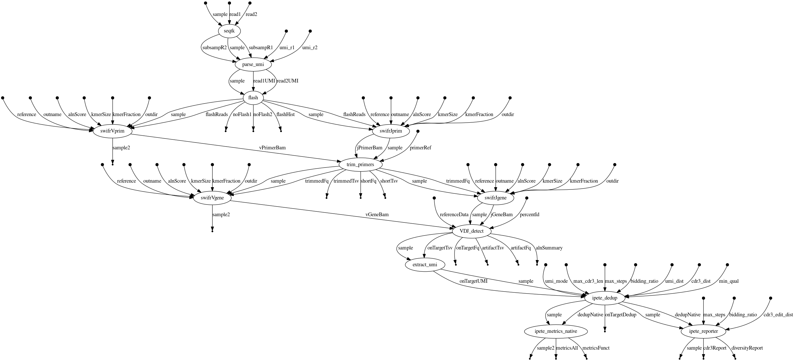

# Daedalus

Nextflow pipeline for analysis of libraries prepared using the ImmunoPETE assay.

- [Daedalus](#daedalus)
    - [Download](#download)
    - [Build Conda Environment](#build-conda-environment)
    - [Test Pipeline](#test-pipeline)
    - [Run Pipeline](#run-pipeline)
        - [Load Environment](#load-the-environment)
        - [Generate Manifest from Sample Sheet](#generate-manifest-from-sample-sheet)
        - [Submit Pipeline Run](#submit-pipeline-run)
        - [Output](#output)
    - [Workflow](#workflow)
    - [Methods](#methods)

Note... The Nextflow Config file must be configured for the queue.

## Software Requirements 
- built on a linux server: CentOS Linux release 7.7.1908 (Core)
- miniconda3, for package management
- nextflow 19.07.0, to run the pipeline 
- uge, for cluster job submission

## Download git rep
```bash
git clone git@github.com:bioinform/Daedalus.git
cd Daedalus
```

## Packages
- download packages.tar.gz from dropbox, move the packages folder into the Daedalus repo folder.

```bash
tar -xvfz packages.tar.gz
mv packages ./Daedalus
```

## Install SWIFR aligner
A smith waterman alignment implemention (c++) was developed and is used to identfy primers and V/J gene segements from fastq formatted reads. Please read the full README for swifr in the packages folder `./packages/swifr/` for instructions how to install.

## Build Conda Environment

Build the conda environment for running the pipeline:
```bash
conda env create -f environment.yml
```

##install python packages in the loaded conda ENV

```bash
conda activate Daedalus_env
./install_packages.sh
```

## Nextflow configuration
Nextflow must be configured for each system. The ipete profile in the nextflow config file `./nextflow/nextflow.config` should be updated accordingly.


## Test Pipeline on a single sample
Once all the software has been installed and nextflow has been configured the pipeline bats test can be run. The bats test runs the pipeline on a single sample, from the paired fastq files provided:
- PBMC_1000ng_25ul_2_S6_R1_001.fastq.gz
- PBMC_1000ng_25ul_2_S6_R2_001.fastq.gz

In order the run the test, download both files from dropbox and move them into the data folder `Daedalus/data`. Once the data is available, run the test using the following commands:

```bash
conda activate Daedalus_env
cd test
bats single-sample-ipete.bats
```

An example of the pipeline output has also been provided: `PBMC_1000ng_25ul_2.tar.gz`


## Running Pipeline
Running the pipeline requires a complete flowcell worth of immunoPETE libraries.

### Load the Environment

```bash
conda activate Daedalus_env
```

### Generate Manifest for ImmunoPETE Run from the Sample Sheet

```bash
manifestGenerator = /path/to/Daedalus/pipeline_runner/manifest_generator.py
illuminaDir = /path/to/illumina/run_folder
sampleSheet = /path/to/sampleSheet.csv

python ${manifestGenerator} \
       --pipeline_run_id Daedalus_example_run \
       --sequencing_run_folder ${illuminaDir} \
       --sequencing_platform NextSeq \
       --output Daedalus_example_manifest.csv \
       --subsample 1 \
       --umi_mode True \
       --umi2 'NNNNNNNNN' \
       --umi_type R2 \
	   ${sampleSheet}

```

The manifest file contains all parameters needed for the pipeline to run. Sample specific tuning of parameters or any updates to the parameters can be acheived by editing the manifest file generated. After edits are complete, the pipeline can be submitted using the manifest file alone.

### Submit the Pipeline Run on the cluster

Using the output from Manifest Generator `Daedalus_example_manifest.csv` pipeline runs are submitted using the script: pipeline_runner.py. 

```bash
pipelineRunner=/path/to/Daedalus/pipeline_runner/pipeline_runner.py
outDir=/path/to/analysis/output

python ${pipelineRunner} -g rssprbf --wait --resume -o ${outDir} Daedalus_example_manifest.csv
``````

A `-g $group` needs to be provided to submit jobs to SGE cluster on SC1. 

### Pipeline Output

At the specified output directory `${outDir}`, the analysis folder will be written using the `pipeline_run_id` "Daedalus_example_run"  

```bash
${outDir}/Daedalus_example_run
```

## Nextflow Workflow DAG



## Methods
Overview of the [Pipeline Methods](docs/Daedalus_methods.md) for key processing steps.


