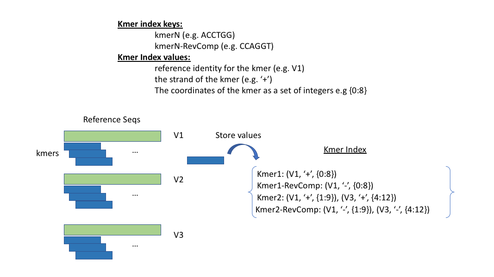
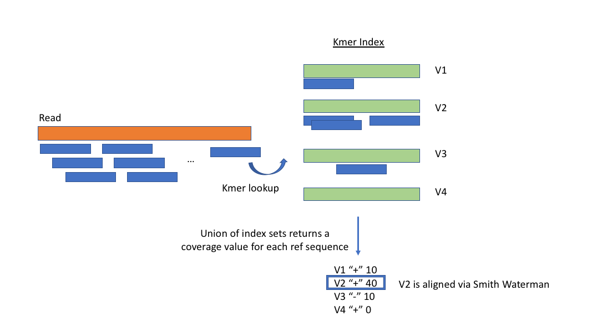

## V-J segment detection
V and J gene segments are aligned against Reads using [swifr](http://ghe-rss.roche.com/plsRED-Bioinformatics/swifr). 
SWIFR (Smith Waterman Implementation for Fast Read identification) utilizes a `kmer similarity index` and the `Smith Waterman` alignment algorithm to identify gene segements within reads.

### Kmer Indexing
Because the Smith Waterman alignment algorithm is costly, it is not time efficient to align all reference sequences to each read in order to find the best alignment.
To reduce the total number of alignments, or alignment search space, an index is commonly used. The Kmer index is used to identify which reference sequences have a high identity against a given read.

To Build the kmer index each reference sequences is broken up into kmers with length specified by `-k`. Each kmer and its reverse complement are stored in the index with a variety of values
`Reference Identity`: which Reference sequence the kmer was generated from.
`Strand`: which strand the kmer was generated from.
`Kmer Coordinates`: the positions this kmer was found in.

### Finding Best Alignment
After the Kmer index has been built, Reads are compared against the index to identify reference sequences with similarities.
Any Reference sequence with a significant amount of coverage (from `Kmer Coordinates`) are selected from the index from alignment.

Reference sequences are aligned if they pass one of two criteria

1) All sequences within 1 unit of standard-deviation from the maximum coverage value `OR` All sequences greater than 2 units of standard-deviation from the mean (whichever has fewer alignments)
3) All sequences whose coverage exceeds a minimum threshold, specified by the parameter `-F`

All sequences selected from the index are aligned using the smith waterman alignment algorithm. Any alignment that passes the minimum alignment score threshold `-s` will be traced and reported. If multiple alignments exist, they will be reported by order of score. The maximum number of alignments to report can be further controlled by `-m`

