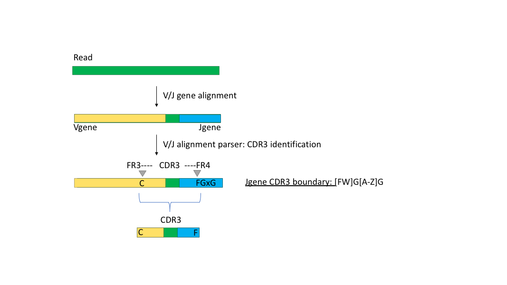

## Alignment Parsing
After V and J gene alignment, read alignments are parsed along with the reference annotation to find the CDR3 sequence.

CDR3 boundary elements are annotated in the ImmunoDB reference: http://ghe-rss.roche.com/plsRED-Bioinformatics/immunoDB

Reads are classified into one of three categories out of the alignment parser
- `on_target`: V-D-J recombinants were detected with a putative CDR3 sequence. Each gene alignment was found to be greater than the minimum identity argument `-i` (default = 85%). V gene alignments must cover the FR3-CDR3 boundary and J gene alignments must coverage the CDR3-FR4 boundary. Additionally, if no J gene alignment is found the Jgene boundary motif `[FW]G[A-Z]G[A-Z]` is searched for downstream of the Vgene boundary. If the Jgene motif is found, the read is still labeled as on-target
- `artifacts`: V and/or J alignments may have been found but do not pass the criteria for being on-target. Either the minimum identity `-i` was not satisfied for one of the segements, one of the CDR3 boundary elements was not covered by the alignment, a V or J alignment (or J CDR3 motif) was not found, or the V alignment did not occur before the J alignment.  
- `no_aln`: Neither V nor J gene alignments were found for the read.

*on_target read identification*

For each read category, all reads and alignment stats are split into separate files. Additionally, `on_target` reads contain additional fields for the `CDR3` and `D-region` sequences.

