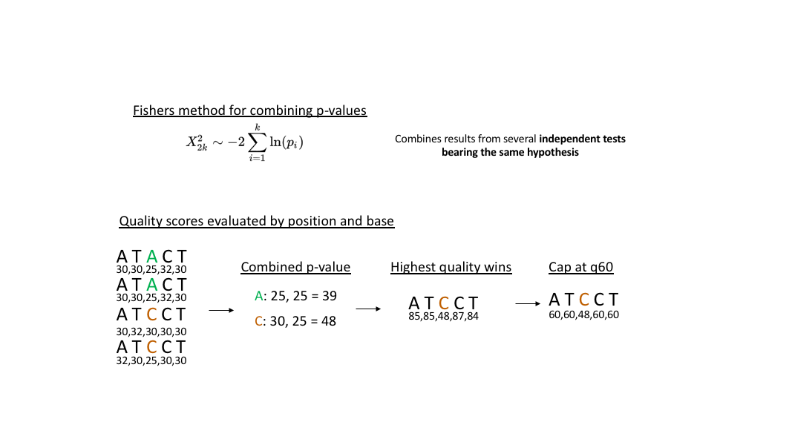

## UMI and CDR3 consensus
After Deduplication, a consensus sequence is derived to determine the most probable CDR3 representation from each read cluster. To derive consensus, quality values are used to determine the most probable sequence at each position of the CDR3. Since `quality values` are simply a transformation of the `p-values`, all matching base calls at a given position can be combined together using Fisher's method. The `combined p-values` for each base call are compared, the base with the lowest combined p-value (highest combined quality) is reported as the base call for each postion in the read. A `consensus quality` is also defined by transforming the `combined p value` to a quality score for each position. Any `consensus quality` scores that exceed 60 are capped at 60, since we are limited in the number of ASCII characters for reported.

Using this method, a `consensus sequence` and `consensus quality` string are derived for both the `UMI` and `CDR3` sequences for each UMI family.  

