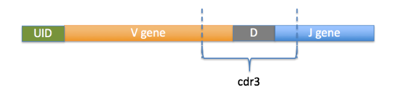
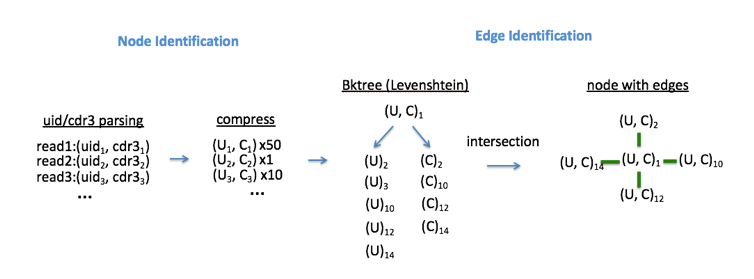
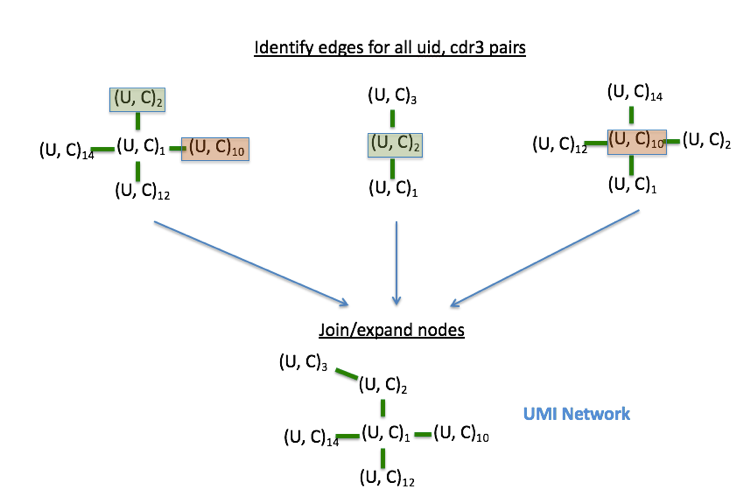
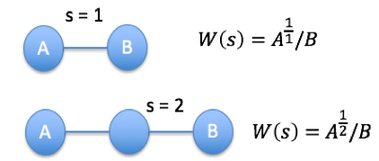
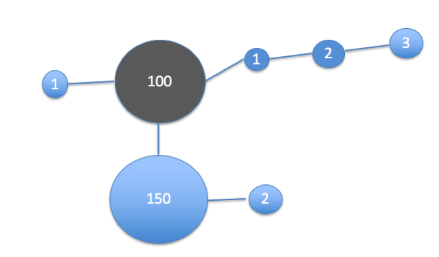
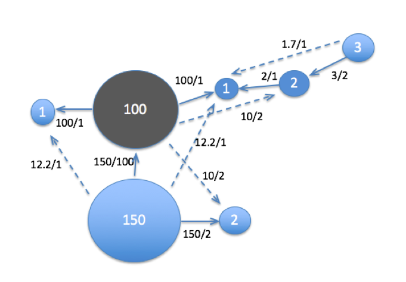
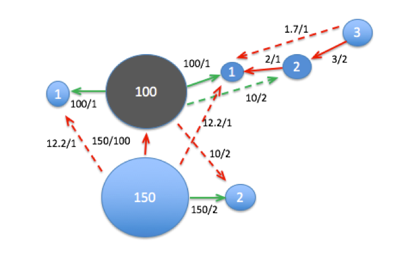
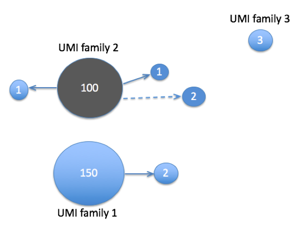
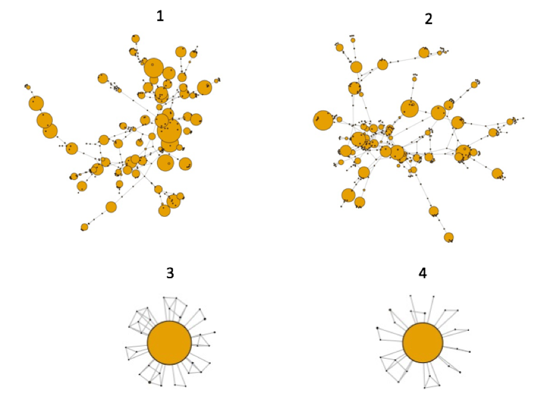
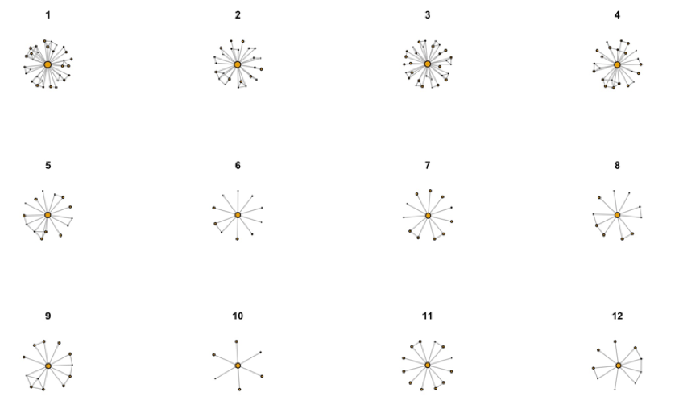

##	UMI-CDR3 Deduplication
For ImmunoPETE libraries, reads are deduplicated by using both the `UMI` and `CDR3` sequences. `UMI` sequences are artificially introduced to the reads to help differentiate unique molecules. Likewise, `CDR3` sequences differentiate different T-cell clonaltypes, which is highly variable for most biological samples. Thus, both the `UMI` and `CDR3` sequences can be used togeher to cluster reads and eliminate sequencing errors, refine clone counts, and accurately measure diversity. In this algorithm, a UMI/CDR3 similarity network is constructed, whose nodes are UMI-CDR3 sequence tuples with the number of supporting reads as weight for each node. Edges in the network are found by searching a bktree for neighboring UMI and CDR3 seqences within 1 nt edit-distance. The Network provides a potential connection between true UMI families and sequencing error events. 

#### Identification of UMI and CDR3 from reads.
V gene segments contain a conserved Cysteine residue downstream of the framework3 region. Likewise, J gene segements contain a conserved motif [FW]GxG (x=any AA) at the framework 4 boundary. With these positions annotated in the reference, the CDR3 sequence can be parsed from any contig containing both V and J gene alignments. 

Figure1: Schematic representation of a VDJ read target. The first 13bp of the target contain the UMI, whereas the CDR3 sequence is parsed from the annotated boundaries within the V and J gene segments.

#### Construction of UMI/CDR3 graph 
Figure2 :Construction of UMI/CDR3 graph. Both UMI and CDR3 sequences are stored in bktrees, where each tree is queried to find reads with similar UMI or CDR3 sequence. Only reads with both UMI and CDR3 similarities are connected by an edge, thus only the intersection of UMI and CDR3 bktree queries are kept.

By Identifying the edges for all nodes in the graph, we construct a network, which branches all nearby events ((U,C)3 with (U,C)1) for example (figure3)
 
Figure3: Example of connectivity between node `(U,C)1` and `(U,C)3` via `(U,C)2`. Nodes connected by any edges can either be due to sequencing error, PCR error, PCR/sequecing error combination, or also may happen to be real randomized events (two UMIs can be sampled which are 1nt apart). 

#### Network Scoring.
If two nodes are connected by an edge, the edge is either kept or rejected by the algorithm prior to collpasing the graph into `UMI families`. The larger the ratio between two node, the increase in probability that the nodes are connected via PCR/sequencing error event. Likewise, PCR and sequencing errors can combine together to produce multiple steps in the network. Thus ,the weight between two nodes (A and B) are compared using the function `W(s) = A^(1/s)/B`. `W(s)` represents the weight that node A exhibits on B, depending on the number of steps between A and B in the network
	 
Figure4: Schematic representation of nodes A and B connected by one or two steps (edges).
 
		
Figure5: Network construction and network scoring

A) graph representing reads connected by similar UMI/CDR3 sequences:
 

B) All scores are calculated, comparing the weight of each node within two steps on the network. 
 
 

#### Clustering, defining umi families. 
The weight function `W(s)` represents a bid from A to B. If the weight is above the specified minimum, B is considered an error event of A.  All other edges connected to B are thus removed, since B cannot be an error from two different molecules. A `BidRatio` is used to set a threshold for when one node can accept the bid from another. Bids can only be accepted if they are sufficiently large.
Several parameters are possible:
- `W(s) >= 2` is useful for modeling PCR error rates. If a PCR error occurs in an early cycle, the weight of node B can be as much as 50% of node A (first cycle error)
- `W(s) >=50` or 2% error rate can be useful modeling sequencing errors only, which are expected to occur at frequencies less than 1% for illumina platforms.

The default `Bid Ratio` is 2 for this pipeline.

Finally, centroids are defined in the graph. Centroid nodes are representative nodes, or nodes with large weights that are likely true events. Any node that is defined as a centroid is considered a real event by the algorithm and are prevented from clustering together. Thus, any edges found between centroids are removed during the partitioning steps. Centroids are dynamically defined during the construction of the graph by using an efficiency calculation.

__Centroid Definition, Efficiency Calculation__
`Efficiency = Work output / Work input`
- `Work output` : The cummulative percentage of reads binned to `N` nodes
- `Work input` : the square root of `N` nodes considered. 

The maximum of `Work output` / `Work input`

Figure6: UMI family definition
Considering the scored network, for the given heuristacs (bid ratio = 2 and centroid nodes `100` and `150`). all green edges represent accepted bids, and red represent edges to be removed.
 

After removal of un-accepted edges, Three UMI families are defined. 

Figure6: SUP_T1 cell line UMI/CDR3 networks. 
A)Here is shown the top 4 larges networks contructed, prior to the clustering. All nodes reprent reads with shared UMI/CDR3 sequences. These networks represent several connected centroid sequences. 
 

After network clustering is performed, the top 12 umi networks demonstrate all the subgraphs which are defined from the much large networks. All subgraphs are plotted in log scale to display the edges, but show a centroid connected to several smaller nodes (error events).

 

